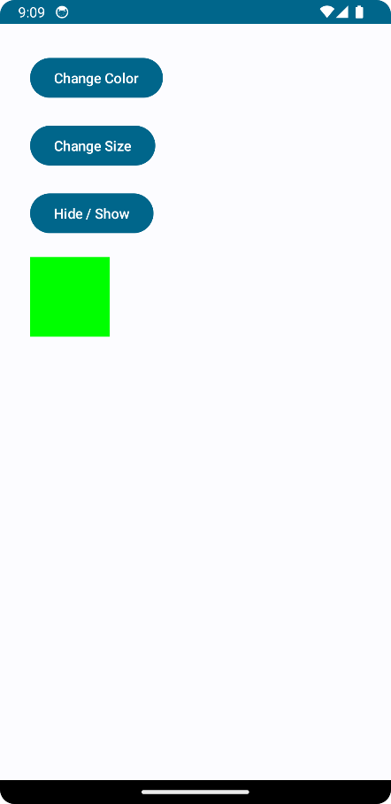
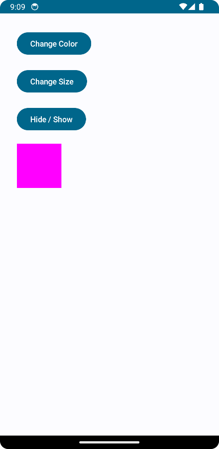
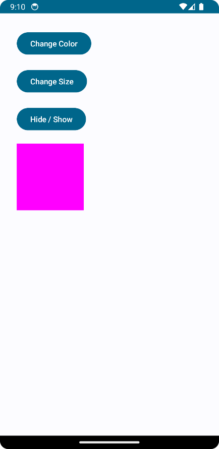
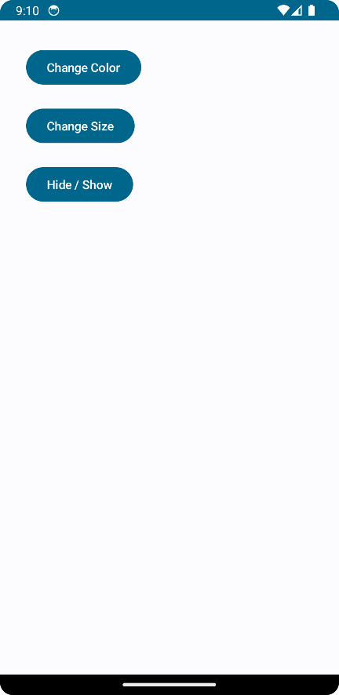

# AndroidAnimation-Android-Jetpack 🎉📱

Welcome to the repository for the AndroidAnimation Android application built using Jetpack Compose! This app is a simple animation application that demonstrates the use of animation components in Jetpack Compose. It's a fun and interactive way to explore the capabilities of Jetpack Compose. 😄🚀

## Features 🎯

- **State and Animation**: The `HomePage` composable uses mutable states to control the color, size, and visibility of a box. It also animates these changes using `animateColorAsState` and `animateDpAsState`.
- **Interactive Elements**: The `HomePage` includes buttons that allow the user to interact with the box. These buttons can change the color, size, and visibility of the box.
- **Visibility Animation**: The visibility of the box is animated using `AnimatedVisibility`, providing a smooth transition when the box is shown or hidden.

## Screenshots 📸

   

## How to run 🏃‍♂️

- Clone this repository using `git clone https://github.com/KarthiDreamr/AndroidAnimation-Android-Jetpack.git`
- Open the project in Android Studio Arctic Fox or later
- Run the app on an emulator or a physical device

## License 📝

This project is licensed under the GNU General Public License (GPL-3.0). The GPL is a strong copyleft license that requires improvements to be shared back with the community. For more information, see the [LICENSE](LICENSE) file.
